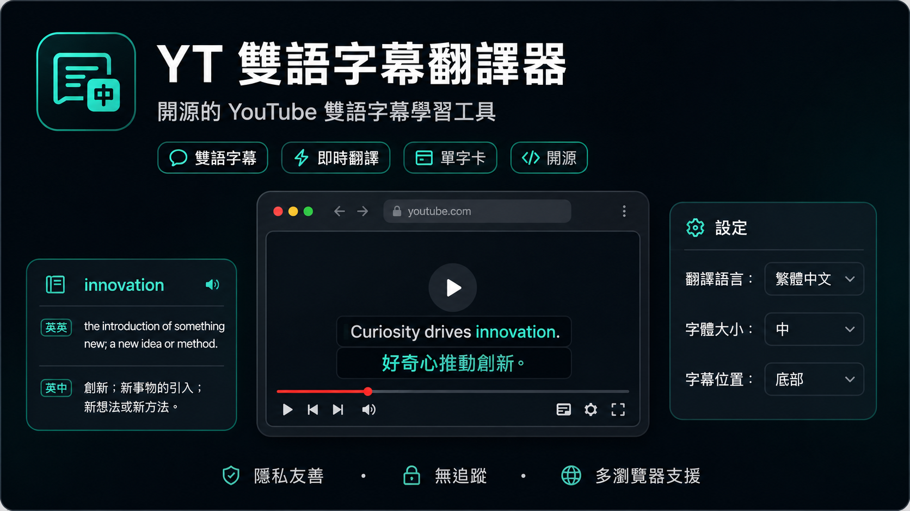
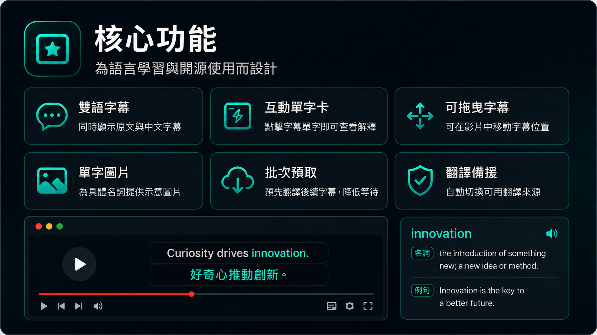
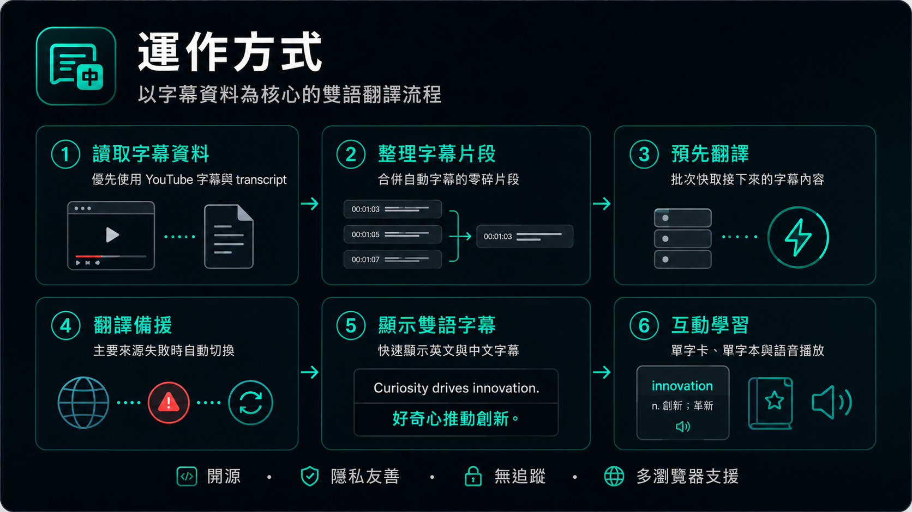

# YT 雙語字幕翻譯器
> Firefox-first 的開源 YouTube 雙語字幕學習擴充功能。  
> 目標是把 YouTube 字幕變成「原文字幕 + 可自訂目標語言翻譯 + 單字學習」的輕量工具。

[English](./docs/languages/README.en.md) · [日本語](./docs/languages/README.ja.md) · [한국어](./docs/languages/README.ko.md) · [Español](./docs/languages/README.es.md) · [简体中文](./docs/languages/README.zh-CN.md)



## 專案定位

這是一個**給 Firefox 使用的 WebExtension 擴充功能**，目前以 Firefox MV2 作為主要測試版本，方便在 Firefox 桌面版與部分 Firefox Android 測試環境中載入。

它會在 YouTube 影片上顯示雙語字幕，並提供初次使用導引、可自訂翻譯目標語言、互動式單字卡、單字本、字幕拖曳、字幕預取與免費翻譯來源備援。這個專案不是 YouTube 官方、Google 官方、Microsoft 官方、Wikipedia / Wikimedia 或 LibreTranslate 官方產品。

## 這份 README 的目的

這份文件不只是使用說明，也作為日後開發新功能時的參考文件。它會整理：

- 目前功能的使用目的
- 使用者如何安裝與測試
- 目前系統如何運作
- 主要檔案與模組分工
- 字幕、翻譯、單字卡的流程
- 後續新增功能時需要注意的設計原則

## 核心功能



| 功能 | 說明 | 使用目的 |
|---|---|---|
| 雙語字幕 | 同時顯示原文字幕與可自訂目標語言翻譯 | 看影片時保留原文語感，也能快速理解內容 |
| 影片播放器旁開關 | 在 YouTube CC 字幕旁加入「雙 / OFF」開關 | 不需要打開 Popup，也能立即切換本外掛雙語字幕 |
| 原生字幕自動切換 | 開啟雙語字幕時自動隱藏 YouTube 原字幕；關閉時恢復 YouTube 原字幕 | 避免原版字幕和外掛字幕同時疊在畫面上 |
| Transcript-first 字幕引擎 | 優先讀取 YouTube timedtext / transcript，而不是只抓畫面上的字幕文字 | 減少自動字幕一詞一詞跳動、漏句或重新翻譯 |
| 自動字幕穩定分段 | 合併 YouTube 自動字幕的零碎片段 | 讓字幕比較像正常一段一段顯示 |
| 批次預取翻譯 | 預先翻譯接下來約 30 秒字幕 | 降低每句字幕都等待翻譯的情況 |
| 翻譯備援 | Google / Microsoft / Lingva / LibreTranslate / MyMemory 等來源自動切換 | 免費翻譯來源被限流或失敗時，仍可繼續使用 |
| 互動單字卡 | 點擊英文單字查看英英、目標語言解釋、例句與發音 | 看影片時同步累積單字理解 |
| 單字圖片 | 對具體名詞嘗試顯示 Wikipedia / Wikimedia 參考圖片 | 用圖片輔助記憶具體單字 |
| 加入單字本 | 將單字加入本機單字本，並可匯出 JSON | 方便後續複習或接到其他學習工具 |
| 可拖曳字幕 | 字幕卡可拖動，位置保存於目前影片 | 避免字幕擋住影片重點畫面 |
| 多語系介面 | 插件介面可切換繁中、英文、日文、韓文、西文、簡中 | 讓不同使用者可以看懂設定畫面 |

> 注意：目前「插件介面語言」與「字幕翻譯目標語言」是分開設定的。第一次使用時會先選介面語言，再選字幕翻譯目標語言。

> v0.25 起，播放器控制列的 CC 字幕旁會出現「雙 / OFF」切換鍵。開啟時顯示本外掛雙語字幕並隱藏 YouTube 原字幕；關閉時隱藏本外掛字幕並恢復 YouTube 原字幕。


## 版本更新

完整更新紀錄請查看 [CHANGELOG.md](./CHANGELOG.md)。README 只保留目前功能與架構說明，避免版本更新內容堆在文件最上方。

## 安裝與測試方式

### Firefox 桌面版

1. 下載或 clone 這個 repo。
2. 打開 Firefox。
3. 前往 `about:debugging#/runtime/this-firefox`。
4. 點選 **Load Temporary Add-on**。
5. 選擇專案根目錄中的 `manifest.json`。
6. 打開 YouTube 影片並開啟字幕。
7. 點擊工具列上的擴充功能圖示調整設定。

### Firefox Android

Firefox Android 對擴充功能支援會依版本與測試環境有所不同。此專案使用 Firefox-first MV2 架構，目標是讓 Firefox 測試較容易，但 Android 端仍建議先以開發者測試方式驗證。

### Chrome / Edge 參考

此 repo 主要給 Firefox 使用。若要嘗試 Chrome / Edge，可參考：

```text
chrome-mv3-template/manifest.mv3.chrome.json
```

目前 Chrome / Edge 不是主要保證平台，若要正式支援，建議另開分支處理 MV3 service worker、權限與測試流程。

## 使用方式

1. 開啟 YouTube 影片。
2. 確認 YouTube 原字幕已開啟。
3. 外掛會嘗試抓取完整字幕資料。
4. 成功後會顯示原文與你選擇的目標語言翻譯。
5. 點擊英文字幕中的單字，可以打開單字卡。
6. 在單字卡中可以查看英英、目標語言解釋、例句、發音與圖片。
7. 點擊「加入單字本」即可保存單字。
8. 字幕卡右上角可拖曳位置，雙擊拖曳把手可重設。

## 系統如何運作



### 簡化流程

```text
YouTube 頁面載入
  ↓
content.js 注入字幕 UI 與監聽器
  ↓
page-bridge.js 進入 YouTube 主世界，讀取 player response / captionTracks
  ↓
content.js 嘗試抓取 timedtext json3 字幕資料
  ↓
字幕引擎整理自動字幕片段，產生穩定 cue window
  ↓
根據 video.currentTime 找出目前字幕
  ↓
預取未來 30 秒字幕，送到 background.js 批次翻譯
  ↓
background.js 進行快取、批次、節流、失敗備援
  ↓
content.js 顯示原文 + 目標語言雙語字幕
  ↓
點擊單字時，查字典、翻譯、圖片，並顯示互動單字卡
```

### 為什麼不用單純抓畫面字幕？

YouTube 自動產生字幕常常是 word-level timing，也就是一個單字一個單字進來。如果只讀畫面上的字幕，會出現：

- 每個字都重新翻譯
- 字幕一直閃爍
- 前半句或後半句遺失
- 快取 key 不一致，造成重複請求

所以本專案採用 **transcript-first**：優先讀 YouTube timedtext / json3 字幕資料，再用時間軸對應目前播放位置。只有當 transcript 讀取失敗時，才退回畫面可見字幕的 fallback 模式。

## 專案結構

```text
.
├── manifest.json                         Firefox MV2 擴充功能設定
├── background.js                         翻譯、字典、圖片、快取、備援與背景請求
├── content.js                            YouTube 頁面字幕引擎、overlay、單字卡、拖曳互動
├── content.css                           字幕 overlay、單字卡、拖曳 UI 樣式
├── page-bridge.js                        注入 YouTube 主世界，讀取 player / captionTracks / timedtext URL
├── i18n.js                               多語系字串與介面翻譯工具
├── popup/
│   ├── popup.html                        設定頁 HTML
│   ├── popup.css                         設定頁樣式
│   └── popup.js                          設定頁邏輯、單字本匯出與語言切換
├── icons/                                擴充功能圖示
├── docs/
│   ├── assets/                           README 圖片素材
│   ├── languages/                        多語系 README
│   ├── ARCHITECTURE.zh-TW.md             系統架構詳細說明
│   ├── PROJECT_STRUCTURE.zh-TW.md        檔案結構與開發參考
│   ├── CLOUD_TRANSLATION_SETUP.md        Google Cloud Translation 設定參考
│   ├── TRANSLATION_PROVIDERS.md          翻譯來源備援說明
│   └── TEST_CHECKLIST.md                 測試清單
├── chrome-mv3-template/                  Chrome / Edge MV3 參考 manifest
├── CHANGELOG.md                          版本紀錄
├── CONTRIBUTING.md                       貢獻指南
├── PRIVACY.md                            隱私說明
└── LICENSE                               MIT License
```

## 主要模組說明

### `content.js`

負責 YouTube 頁面上的主要功能：

- 建立雙語字幕 overlay
- 控制字幕顯示與 no-flicker render
- 注入並接收 `page-bridge.js` 回傳的 YouTube player 資料
- 抓取 timedtext / json3 字幕
- 合併自動字幕片段
- 根據影片時間選擇目前 cue
- 預取未來字幕並同步顯示快取
- 處理字幕拖曳與每支影片的位置保存
- 處理單字點擊、單字卡、單字圖片、加入單字本

### `background.js`

負責比較容易受跨域、限流或快取影響的背景請求：

- 翻譯文字
- 批次翻譯
- Provider failover
- Provider cooldown
- 翻譯快取
- 字典查詢
- Wikipedia / Wikimedia 單字圖片查詢
- 單字本資料存取

### `page-bridge.js`

Content script 在一般情況下無法直接存取 YouTube 頁面主世界中的 player 物件，所以使用 bridge：

- 讀取 `player.getPlayerResponse()`
- 讀取 `player.getOption('captions', 'track')`
- 觀察 fetch / XHR 中的 timedtext URL
- 透過 `window.postMessage` 回傳資料給 content script

### `popup/`

負責使用者設定與管理：

- 開關插件
- 第一次使用導引：選擇介面語言與字幕翻譯目標語言
- 選擇插件介面語言
- 選擇字幕翻譯目標語言
- 設定字幕大小、位置、寬度
- 設定翻譯來源與備援
- 測試目前翻譯來源
- 顯示與匯出單字本

## 翻譯流程設計

目前的自動免費模式會依序嘗試：

```text
Google Translate Web endpoint
→ Microsoft Edge Translate
→ Google Free
→ Google Dictionary endpoint
→ Lingva
→ LibreTranslate
→ MyMemory
```

設計重點：

- 先查本機快取，避免重複翻譯。
- 可批次時批次送出，減少請求數。
- 翻譯來源失敗、timeout、429、403 或 5xx 時會進入 cooldown。
- 冷卻中的 provider 會暫時跳過。
- 若批次翻譯失敗，會退回逐句翻譯。

## 單字卡設計

點擊字幕中的英文單字後，流程如下：

```text
使用者點擊單字
  ↓
清理單字格式，例如去掉前後標點
  ↓
background.js 查 Free Dictionary API
  ↓
使用翻譯來源補目標語言意思與例句翻譯
  ↓
若是具體名詞，嘗試查 Wikipedia / Wikimedia 圖片
  ↓
content.js 顯示單字卡
  ↓
使用者可加入本機單字本
```

目前圖片只作為輔助，不保證每個單字都有圖片。抽象詞、代名詞、連接詞通常不顯示圖片，以避免錯圖。

## 現有功能可能帶來的成效

| 使用情境 | 可能成效 |
|---|---|
| 看英文 YouTube 影片 | 同時看原文與中文，降低理解門檻 |
| 看日文或其他語言字幕影片 | 自動偵測來源語言並翻成使用者選擇的目標語言 |
| 背單字 | 點字幕單字即可查英英與目標語言解釋，單字可保存 |
| 自動字幕影片 | 透過 transcript-first 與分段邏輯，減少逐字跳動 |
| 免費翻譯不穩 | 透過多 provider 備援降低完全失效機率 |
| 影片畫面被字幕遮住 | 可拖動字幕位置，避免擋住重點內容 |

## 開發新功能時的原則

1. **優先保護字幕穩定性**：不要讓新功能造成字幕閃爍、漏句或重複翻譯。
2. **優先使用 transcript 資料**：只有抓不到 transcript 時才使用畫面字幕 fallback。
3. **所有翻譯請求都應該經過快取與排隊**：避免短時間大量請求。
4. **UI 功能不要阻塞字幕顯示**：單字卡、圖片、查字應非同步處理。
5. **使用者資料只存在本機**：單字本與設定應保留在 browser storage。
6. **避免直接複製 GPL 專案程式碼**：可以參考架構概念，但實作需重新撰寫。

更多細節請看：

- [系統架構說明](./docs/ARCHITECTURE.zh-TW.md)
- [專案結構與開發參考](./docs/PROJECT_STRUCTURE.zh-TW.md)
- [翻譯來源設計](./docs/TRANSLATION_PROVIDERS.md)
- [測試清單](./docs/TEST_CHECKLIST.md)

## 隱私

本擴充功能不需要建立帳號，不主動追蹤使用者，也不販售資料。設定、單字本與字幕位置儲存在瀏覽器 extension storage。翻譯、字典與圖片功能會依使用情境將字幕或單字送到外部服務查詢。詳細請看 [PRIVACY.md](./PRIVACY.md)。


## 專案資訊與參考來源

- 本專案 GitHub：<https://github.com/ErttyOuO/YT-bilingual-translator>
- 協助製作：<https://github.com/ErttyOuO>

本專案的字幕引擎、預取流程與互動學習介面，是在研究多個開源專案後重新實作而成；沒有直接複製 GPL 專案程式碼。

參考與學習的開源專案：

- [Read Frog](https://github.com/mengxi-ream/read-frog)：字幕翻譯、批次佇列、互動學習流程參考
- [yt-dual-sub](https://github.com/reza-nzri/yt-dual-sub)：字幕資料讀取與播放器同步顯示參考
- [BilingualTube](https://github.com/rxliuli/bilingualtube)：YouTube timedtext / transcript-first 架構參考
- [YouTube Subtitle Translator](https://github.com/orange2ai/youtube-subtitle-translator)：早期 YouTube 字幕翻譯 MVP 思路參考
- [multi-subs-yt](https://github.com/garywill/multi-subs-yt)：多字幕顯示概念參考
- [youtube-live-translate](https://github.com/wangruofeng/youtube-live-translate)：字幕 overlay 與互動 UI 參考

## 授權

MIT License。詳見 [LICENSE](./LICENSE)。


## 穩定性修正

v0.25 修正播放器內快速開關造成 YouTube 卡住的問題。新的做法會節流 YouTube 控制列監聽，只在按鈕被移除或控制列重建時重新插入按鈕，避免 MutationObserver 反覆觸發。完整更新請見 [CHANGELOG.md](./CHANGELOG.md)。


## v0.26 安全性更新

已移除硬編碼 Google API Key 與 Google Web Translate 內建來源。免費翻譯備援仍保留 Microsoft Edge Translate、Google Free、Google Dictionary、Lingva、LibreTranslate、MyMemory。


## v0.27 更新

- 修正單字圖片在 YouTube 頁面中可能被擋或無法顯示的問題。
- 單字圖片改由背景腳本抓取後轉為安全的 data URL 顯示。
- 暫停影片時會凍結目前字幕，不再繼續往後跑；播放或拖曳時間軸後才更新。


## v0.28 UI 微調

- 播放器內的雙語字幕切換按鈕已改成較圓潤的 icon 樣式，避免方塊感太重。
- 開啟時顯示彩色 icon；關閉時顯示黑白 icon，並保留提示文字。


## v0.29 UI 微調

- 播放器內切換按鈕改為內嵌 SVG 線條 icon，不再直接放圖片檔。
- 這樣可避免在 YouTube 控制列中出現圖片被裁切、挖空或比例奇怪的問題。
- 開啟時為青綠色，關閉時為灰白色。
